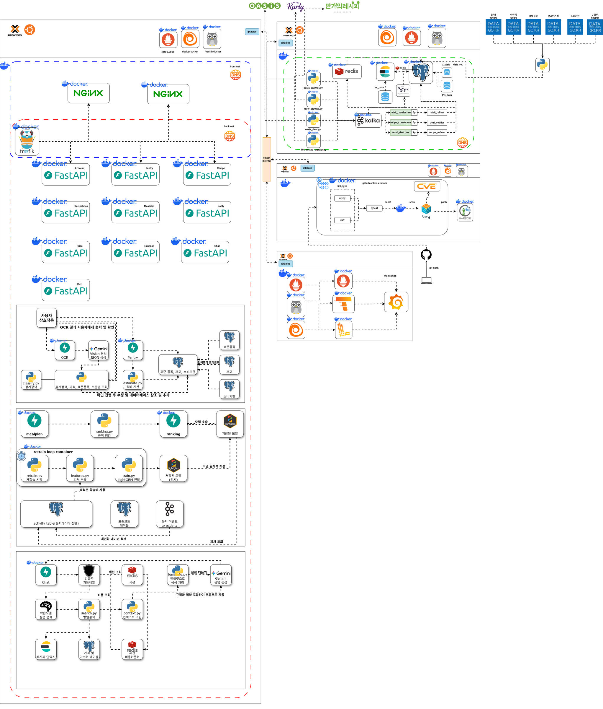
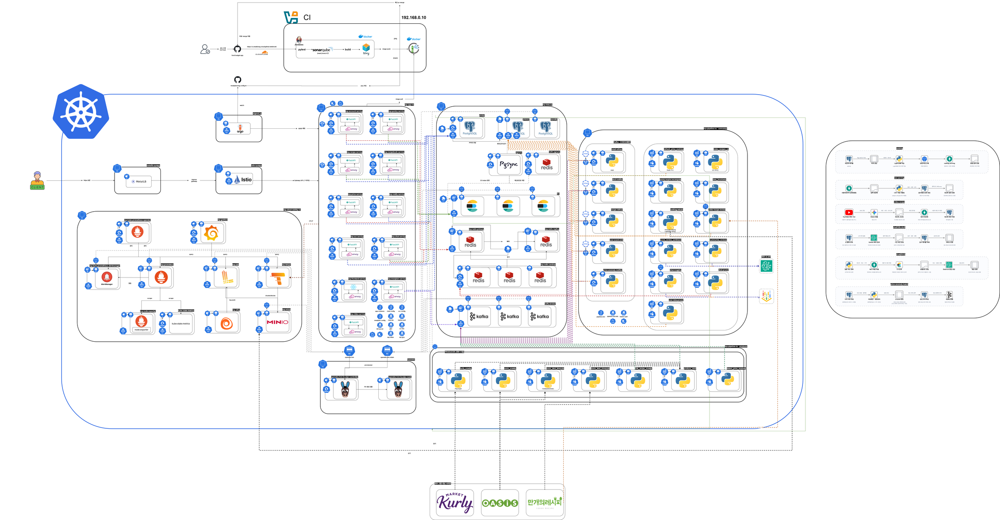
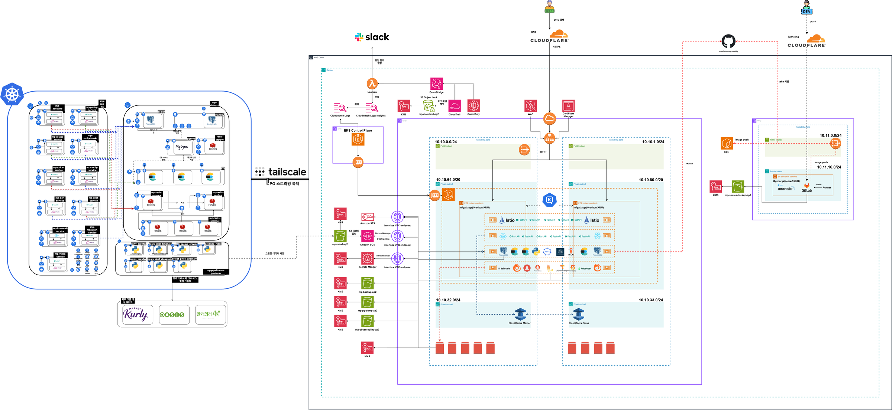
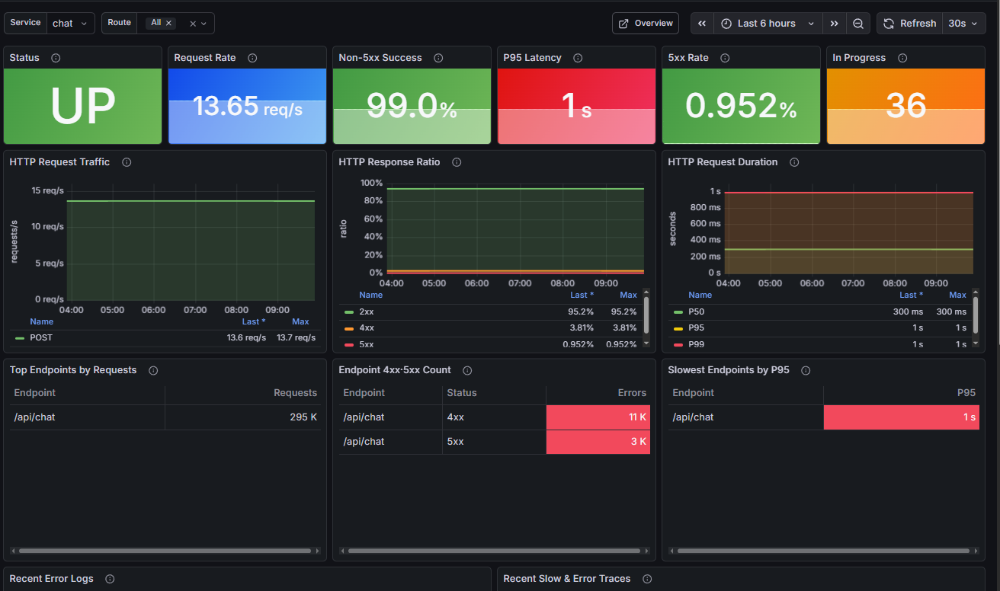
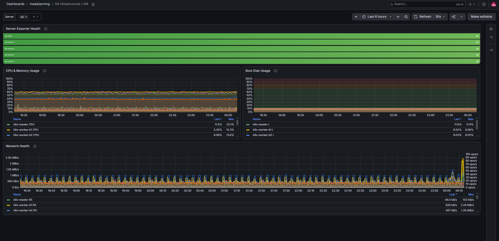
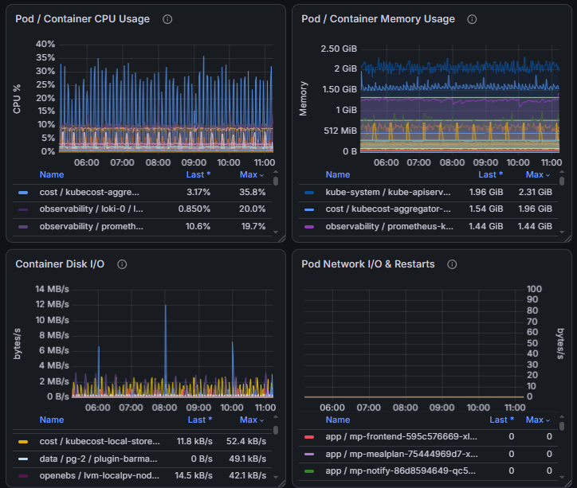
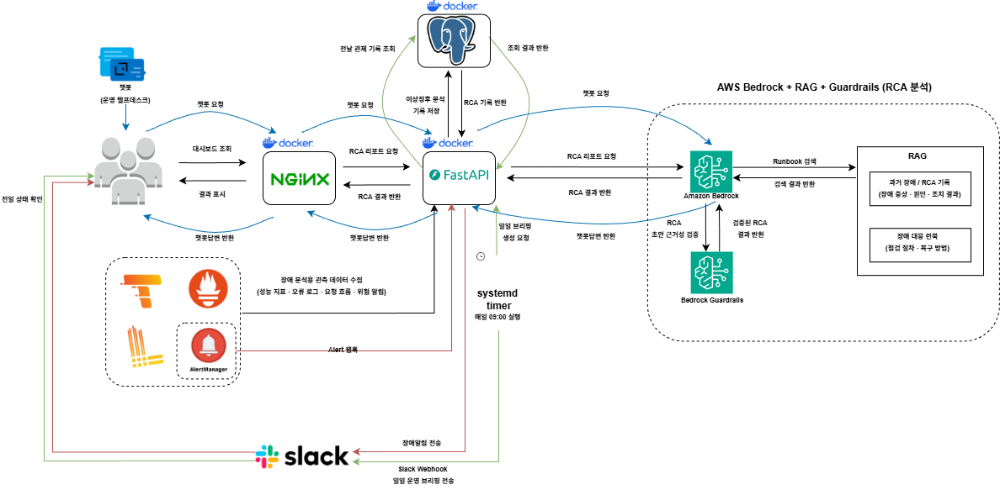
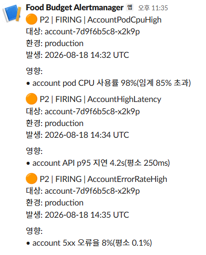
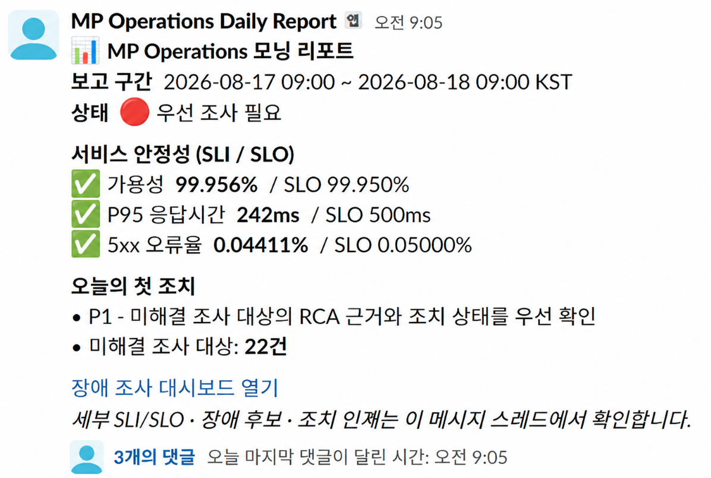

# Meal Planning

## 하이브리드 클라우드 기반 밀플래닝 서비스 · 운영 자동화

> 식재료 소비기한·현재가·월 식비를 연결한 밀플래닝 서비스에, **관측성 이관과 이상징후 대시보드 기반 장애 대응 체계**를 구축한 5인 팀 프로젝트입니다.

| 구분 | 내용 |
| --- | --- |
| 기간 | 2026.06.29 ~ 2026.08.26 |
| 환경 이관 | Docker → Kubernetes → AWS EKS |
| 프로젝트 핵심 | 통합 모니터링 · 성능 검증 · 이상징후 대시보드 구축 · 장애 대응 지원 |

### 프로젝트 한눈에 보기

| 관측성 이관 | 성능 검증 | 이상징후 대시보드 구축 |
| --- | --- | --- |
| Docker에서 수집한 Metric·Log·Trace를 Kubernetes·EKS까지 동일한 방식으로 확장 | nGrinder로 병목 범위를 좁히고 Price API 평균 응답시간 **1,407ms → 4.48ms** 검증 | 분산된 지표·로그·추적 정보를 한 곳에서 조사하고, 이상징후의 원인 분석 가이드를 제공해 장애 대응 시간을 단축 |

### 목차

- [프로젝트 개요](#overview)
- [전체 환경 구성](#environment)
- [공개 코드 구성](#public-code)
- [내가 맡은 역할](#responsibility)
- [기술 이슈와 해결 전략](#troubleshooting)
- [운영 가시성 및 인수인계](#operations)
- [성과 및 기술 역량](#outcomes)

---

<a id="overview"></a>

## 📖 1. 프로젝트 개요

### 💡 배경

1인 가구가 보유 식재료의 소비기한을 놓치거나 월 식비 예산을 초과하는 문제를 줄이기 위해, 레시피·냉장고 재고·현재가·지출을 연결한 밀플래닝 서비스를 구축했습니다.

서비스 기능 구현과 함께 **Docker → Kubernetes → AWS EKS**로 관측 환경을 이관하면서, 기존 관측과 장애 대응 기능을 유지·확장하는 것을 목표로 했습니다. AWS 단계에서는 별도 EC2에 운영 대시보드와 API를 배포해 EKS 관측 데이터를 바탕으로 이상징후 분석과 운영 자동화를 수행했습니다.

### 🎯 핵심 목표

1. 보유 식재료와 소비기한을 반영한 식단 추천
2. 마켓컬리·오아시스 가격 비교 및 월 식비 예산 관리
3. Docker → Kubernetes → AWS EKS 환경 전환
4. Metric · Log · Trace 기반 통합 관측 환경 구축
5. 이상징후 탐지와 AI 기반 장애 분석을 통한 운영 대응 지원

---

<a id="environment"></a>

## 🏗️ 2. 전체 환경 구성

### 🔧 서비스 인프라 기술 스택

| 영역 | 기술 |
| --- | --- |
| Application | FastAPI · React |
| DB & DB Sync | PostgreSQL · PgBouncer · PGSync · Redis |
| AI | Gemini · Vertex AI · LightGBM · Amazon Bedrock · scikit-learn |
| Search Engine | Elasticsearch |
| Registry | Harbor |
| Security | Trivy · SonarQube · Kubernetes 보안 정책·런타임 보안 |
| CI/CD | Jenkins · Argo CD · Argo Rollouts |
| CNI | Cilium |
| Stress Test | k6 · nGrinder |
| Observability | Prometheus · Alertmanager · Grafana · Loki · Tempo · Alloy · OpenTelemetry · Kubecost |
| Pipeline | Strimzi · KEDA · Chromium |
| Infra | Terraform · Ansible · kubeadm · MetalLB · Istio · OpenEBS · MinIO · Cloudflare · Ubuntu · Vagrant |

> 위 목록은 **프로젝트 공통 기술 스택**입니다. 아래 역할 섹션에서는 제가 직접 담당한 Observability·컨테이너 보안·부하 검증·운영 자동화 범위를 구분해 설명합니다.

### 🔄 환경 전환 구조

| 단계 | 환경 | 운영 관점의 핵심 작업 |
| --- | --- | --- |
| 1 | Docker | 통합 모니터링 구축, nGrinder 부하 검증 |
| 2 | Kubernetes | Helm·ArgoCD 기반 관측 스택 이관, Dashboard·Alert Rule·PVC 유지 |
| 3 | AWS EKS | 동일 관측 스택 유지, Loki·Tempo 저장소를 S3·IRSA로 전환 |

### 1) Docker 기반 On-premise 관측 환경

컨테이너 환경에서 애플리케이션과 관측 스택을 연결하고, 부하 검증까지 수행한 구성입니다.



### 2) Kubernetes 기반 관측성 스택

Helm·ArgoCD로 관측 컴포넌트를 이관하고, Dashboard·Alert Rule·영속 볼륨을 유지한 구성입니다.



### 3) AWS EKS 기반 관측 환경

Kubernetes 관측 스택을 EKS로 이관하고, Loki·Tempo의 장기 저장소를 S3와 IRSA Role로 전환한 구성입니다.



---

<a id="public-code"></a>

## 💻 공개 코드 구성

내부 IP·도메인·계정·비밀값을 제외하고, 제가 담당한 운영 구조와 검증 로직을 재현 가능한 형태로 정리했습니다.

| 경로 | 공개한 내용 |
| --- | --- |
| [`docker/operations/`](docker/operations/) | Operations API의 비루트 컨테이너 이미지와 공개용 Compose 구성 |
| [`kubernetes/`](kubernetes/) | Operations Deployment·Service와 Kubernetes 관측 이관에 사용한 ServiceMonitor·Alert Rule·Alloy·Tempo 설정 |
| [`operations-analysis/`](operations-analysis/) | 이상징후 탐지·장애 조사 건 상관분석 로직과 회귀 테스트 |
| [`load-test/`](load-test/) | Price API 부하 검증을 재현하는 k6 스크립트 |
| [`infra/terraform/operations-dashboard/`](infra/terraform/operations-dashboard/) | Operations API용 EC2 IAM·EKS 접근 규칙 Terraform 예시 |

---

<a id="responsibility"></a>

## 👤 3. 내가 맡은 역할

| 환경 | 담당한 운영 과제 | 핵심 산출물 |
| --- | --- | --- |
| Docker | 통합 모니터링 구축 · 컨테이너 보안 · 부하 검증 | Metric·Log·Trace 통합 수집 · Grafana 대시보드 · 보안 정책 · nGrinder 검증 |
| Kubernetes | 관측성 스택 이관 | Helm·ArgoCD 기반 관측 스택 · PVC · Dashboard·Alert Rule 이관 |
| AWS | 이상징후 대시보드 구축 · 장애 분석 자동화 | Operations EC2 · 이상징후 조사 · 관측 근거 기반 원인 분석 · Slack 운영 자동화 |

### A. Docker 기반 통합 모니터링 구축 및 컨테이너 보안

- cAdvisor · Alloy · OpenTelemetry로 Metric · Log · Trace를 통합 수집하고 Prometheus · Loki · Tempo에 연동
- Grafana에서 애플리케이션·VM·컨테이너 상태를 동일 시간 기준으로 조회하는 통합 Dashboard 구성
- 12개 서비스에 Non-root 실행, Read-only RootFS, Capability 제거 적용
- seccomp · AppArmor 정책으로 컨테이너 권한 최소화

#### Grafana 애플리케이션 관측 대시보드

서비스별 상태, 요청량, 성공률, P95 지연, 5xx 오류율, 진행 중 요청과 오류 Endpoint를 한 화면에서 조회하도록 구성했습니다.



### B. Kubernetes 환경으로 관측성 스택 이관

- Helm · ArgoCD로 kube-prometheus-stack, Loki, Tempo, Alloy 기반 관측 스택 배포
- Pod 재생성 후에도 관측 데이터가 유지되도록 Prometheus · Loki · Tempo에 PVC 적용
- Docker 환경에서 사용하던 Grafana Dashboard 13종과 Alert Rule 20종 이관
- Alertmanager와 Slack을 연동해 장애 알림 흐름 구성

#### Grafana 인프라 · 워크로드 관측 대시보드

5개 노드의 Exporter 상태와 CPU·메모리·Disk·Network 사용량을 조회하고, Pod/Container 단위의 CPU·메모리·Disk I/O·Network I/O·재시작 지표를 함께 확인하도록 구성했습니다.





### C. AWS 기반 이상징후 대시보드 구축 및 장애 분석 자동화

- 별도 Operations EC2의 운영 대시보드·API와 관련 운영 리소스를 Terraform으로 구성
- Rolling Z-score · MAD · 변화율 · 연속 이탈 조건을 조합한 Prometheus 시계열 이상징후 탐지 구현
- 이상징후 대시보드에서 지표별 변화와 조사 우선순위를 한 곳에서 확인하도록 구성
- 경보(Alert)를 시간 · 서비스 · Pod · 의존성 기준으로 분석해 하나의 장애 조사 건으로 연결
- Metric · Log · Trace 근거를 수집하고 Bedrock으로 원인 분석 초안(RCA)과 점검·조치 가이드 생성
- 운영 헬프데스크 챗봇과 Slack 일일 운영 리포트 구현

#### 대표 운영 자동화 설계

운영자가 대시보드에서 원인 분석 결과를 확인하고, 챗봇으로 점검 절차를 조회하며, Slack 알림과 일일 리포트까지 연결되는 구현 구조입니다.



---

<a id="troubleshooting"></a>

## 🛠 4. 기술 이슈와 해결 전략

> 문제 → 분석 → 조치 → 결과 순서로, 운영 관점의 핵심 사례만 정리했습니다.

---

### 01. 로그와 Trace 연결 기준 통일

**문제**

- 서비스마다 로그 형식이 달라 오류 검색 기준이 제각각
- 특정 요청의 로그와 Trace를 연결하기 어려움

**조치**

- FastAPI 로그를 JSON 형식으로 통일
- `trace_id`, `request_id`를 공통 필드로 기록
- Loki Label은 서비스·컨테이너처럼 범위가 제한된 값만 사용

**결과**

- Loki에서 오류를 찾은 뒤 동일 `trace_id`의 Tempo Trace로 바로 연결할 수 있는 기준 마련

---

### 02. nGrinder 부하 검증으로 Price API 병목 범위 축소

**문제**

- 200 → 300 VUser 증가 시 TPS 증가는 미미했지만 응답시간은 크게 증가
- VM CPU는 최대 약 18%로 서버 전체 자원 부족으로 보기 어려움

**분석 및 조치**

| 항목 | 200 VUser | 300 VUser |
| --- | ---: | ---: |
| TPS | 338.32 | 342.97 |
| 평균 응답시간 | 348.63ms | 593.80ms |

- Price 현재가·핫딜 요청에서 최대 약 **8.6초** 지연 확인
- 서버 증설보다 Price API를 우선 점검 대상으로 축소
- 팀의 공통 가격 View 물질화와 Redis 읽기 캐시 적용 후 같은 200 VUser 조건으로 재검증

**재검증**

| 항목 | 개선 전 | 개선 후 |
| --- | ---: | ---: |
| Price API TPS | 58.2 | 94.98 |
| Price API 평균 응답시간 | 1,407ms | **4.48ms** |
| 오류 | 0건 | 0건 |

**결과**

- 평균 응답시간 약 **99.7% 감소**, 개선 후 P95 **2ms** · P99 **6ms**
- 관측 지표와 요청별 지연을 근거로 병목 범위를 좁히고 동일 조건으로 개선 효과 재검증

<details>
<summary>부하테스트 상세 내용 보기</summary>

대상은 Docker Compose 기반 11개 서비스이며, nGrinder `3.5.9-p1`와 Grafana·Prometheus·Loki·Tempo로 VUser, TPS, 평균 응답시간, 오류율, VM CPU, 요청별 지연을 확인했습니다.

상세 테스트 조건과 원본 결과는 [`부하테스트 요약`](docs/load-test-report.md)에 정리했습니다.

</details>

---

### 03. 여러 경보를 하나의 장애 조사 흐름으로 연결

**문제**

- 하나의 장애에서 CPU·지연·5xx 오류 경보가 각각 발생
- 운영자가 Metric·Log·Trace·Pod 상태를 따로 조회해야 함

**조치**

```text
경보 발생
  ↓
장애 조사 건으로 묶기
  ↓
Metric · Log · Trace · Kubernetes Event
  ↓
조사 근거 묶음
  ↓
Bedrock 원인 분석 초안
  ↓
운영자 조치
```

- 시간 · 서비스 · Pod · 의존성 기준으로 경보를 상관분석
- 관련 관측 데이터를 하나의 조사 근거 묶음으로 수집
- 조사 근거와 운영 지식 문서를 Bedrock에 전달해 원인 분석 초안(RCA)과 점검 순서 생성

**결과**

- `경보 → 장애 조사 → 관측 근거 → 원인 분석 → 조치 → 해결 알림` 흐름으로 장애 조사 절차 연결

<details>
<summary>실제 Slack 경보 예시 보기</summary>

동일 Pod에서 CPU·지연·오류율 경보가 연속으로 발생한 Slack FIRING 메시지입니다.



</details>

---

<a id="operations"></a>

## 📡 5. 운영 가시성 및 인수인계

### 운영 헬프데스크 챗봇

운영자는 자연어로 원인 분석 결과, 점검 명령, 런북을 조회할 수 있습니다. 예를 들어 Tempo WAL 오류 발생 시 Pod 상태, 메모리 Limit, PVC·WAL 로그를 우선 확인하도록 안내합니다.

### 매일 09:05 운영 리포트

전일 09:00부터 당일 09:00까지의 경보·장애 조사·원인 분석·조치 상태를 매일 09:05 KST에 Slack 스레드로 전달해, 다음 담당자가 미해결 항목을 이어서 조사할 수 있도록 구성했습니다.

- SLI/SLO: 가용성, 5xx 오류율, p95 응답시간
- 우선 조사 장애 건과 관측 근거
- 오늘의 조치 항목과 미해결 조사 대상
- 상세 장애 조사 대시보드 링크



---

<a id="outcomes"></a>

## 🎯 6. 성과 및 기술 역량

- Docker 환경의 Metric · Log · Trace 관측 스택을 Kubernetes 환경으로 이관
- Grafana Dashboard 13종과 Alert Rule 20종을 이관해 운영 가시성 유지
- nGrinder 부하 테스트로 병목 범위를 축소하고, 동일 조건 재검증 수행
- Price API 평균 응답시간 **1,407ms → 4.48ms**, 약 **99.7% 감소** 확인
- 구조화 로그와 Trace 연계로 장애 원인 추적 기준 수립
- Metric · Log · Trace · 경보를 장애 조사, Bedrock 원인 분석, Slack 운영 흐름으로 연결
